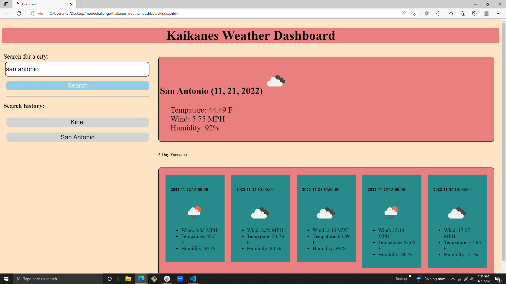

# Kaikanes-weather-dashboard
***
My site that displays the current and future weather forcast for muliple citys. The user can look up a city and the site will show current and future (5days) conditions for that city. The search result will have basic information about the city like the city name, date, and cool icons for the tempature, humidity, and wind speed. There is also a search history that keeps track of the citys the user searches for and when clicked will take the user back and show the citys fore-cast.
## Usage
***
For travelers to see weather conditions of multiple cities and use that knowledge to plan trips.
### Technologys
***
* www.google.com
* www.w3schools.com
* Github.com
* Slack
* Zoom
#### Screen shot
***

##### Link
***
click for deployed app
[click me](https://lacnoskillz.github.io/Kaikanes-weather-dashboard/)